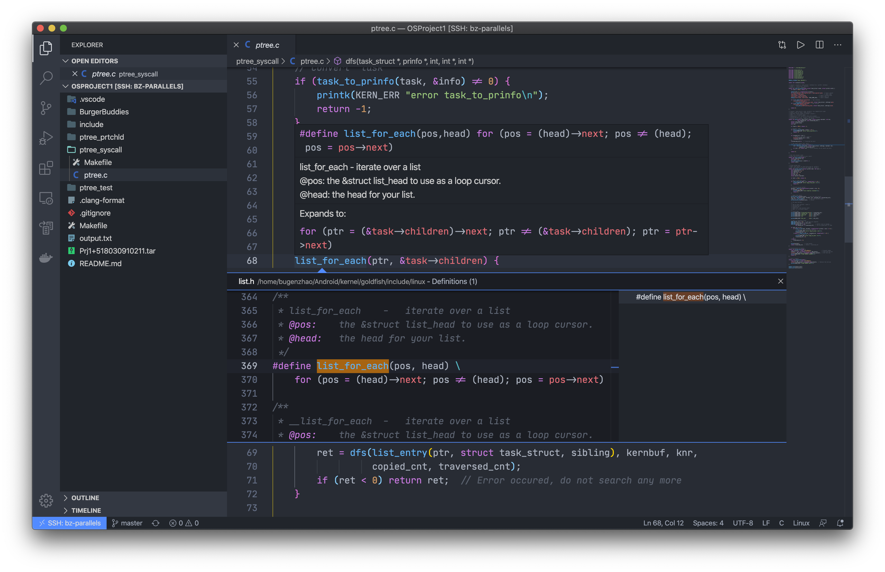

# Report for CS356 Operating System Projects - Spring 2020 - Project 1

##Personal Information

Ziqi Zhao (赵梓淇, Bugen Zhao, 518030910211), F1803302, CS, SEIEE, SJTU. 

##Introduction

In this project, we are asked to learn about Linux kernel development, to understand how to add and use Linux system calls, and basic knowledge of process/thread synchronization in the operating system. In addition to meeting the project requirements, in this report, I've found the following techniques helpful for us doing the kernel and concurrency development in a more efficient, secure, and robust way.

## Techniques

### Visual Studio Code Remote Development

In general, editing and developing directly from a Linux terminal with editors like `vim` and `emacs` is not a trivial thing for everyone, and running a graphical IDE on a Linux virtual machine may suffer the poor performance. Visual Studio Code provides us with a better way to do such a thing, that is called "remote development".

Remote development is based on SSH connection. All of what we need to do is write down several lines in the SSH config file of the local machine, generally located at `~/.ssh/config`. The configuration is like the following:

```
Host bz-parallels
    HostName bz-parallels.local
    User bugenzhao
    Port 22
```

After doing this, we can directly connect to the remote Linux machine via SSH in Visual Studio Code, and then enjoy the local editing experience as well as a remote Linux development environment :)

On the other hand, there are a lot of APIs and their simple documentation provided by Linux kernel code, which are, however, not so easy for us to recognize them directly in millions of codes. Although there are tools like Linux Cross Reference (LXR), it is still not convenient enough to check the usage or definition. Thanks to the function which is called *IntelliSense for C/C++* in Visual Studio Code, we can easily get the useful features like syntax highlighting and diagnostics for our code after configuration.

One configuration I proposed is as follows, which has already been shared on https://gist.github.com/BugenZhao/a251c71d197e0295a8ef94da037ec3d1 and also in our WeChat group and lecture on Saturday:

```json
{
    "configurations": [
        {
            "name": "Linux",
            "includePath": [
                "${workspaceFolder}/**",
                "~/Android/kernel/goldfish/include",
                "~/Android/kernel/goldfish/arch/arm/include"
            ],
            "defines": [
                "__KERNEL__",
                "__GNUC__=4",
                "_GNU_SOURCE"
            ],
            "compilerPath": "/usr/bin/gcc",
            "cStandard": "c89",
            "intelliSenseMode": "gcc-x64",
            "browse": {
                "path": [
                    "${workspaceFolder}/**",
                    "~/Android/kernel/goldfish/include",
                    "~/Android/kernel/goldfish/arch/arm/include"
                ],
                "limitSymbolsToIncludedHeaders": true,
                "databaseFilename": ""
            }
        }
    ],
    "version": 4
}

```

The key of configuration is to provide correct `include` directories and `define`s. To get the symbols analyzed successfully, we need to provide the location where the headers are. Besides, Linux kernel source code will correctly compile only if we have `define`d several macros, like `__KERNEL__` and `__GNUC__`, to tell the compiler to use the right version of headers and assemblies.



After all of the above configuration, we can now successfully use Visual Studio Code for code jumps, auto-completion, and static diagnostics. It's much easier for me to check the comments and documentation in kernel codes this way.

### Write Tests and Debugging Info with the Code

In the kernel and synchronization development, there are often corner cases or exceptions that need to be covered and handled correctly and carefully. To examine our code for these requirements, a good way is to intentionally write some special cases to test the robustness of the code. It is simple for us to just write down some codes like `WARN_ON()` and `assert()` to test the output value with our expectations.

```c
#define BUGEN_DEBUG
#define bugen_assert(no, lhs, op, rhs, format)          \
    if (!((lhs) op (rhs))) {                            \
        fprintf(stderr, "%s:%d: TEST " #no " ERROR: "		\
                #lhs " == " format "\n",                \
                __FILE__, __LINE__, (lhs));             \
    }

#ifdef BUGEN_DEBUG
run_some_tests();
#endif
```

This is a testing macro in `ptree_test.c` written by myself. It's fairly simple and doesn't use any unit testing frameworks, but it works well with some tests in special cases. If anything unexpected occurs, it would output as below (I just simply removed the `!` operator to get this, in fact), which is easy to check where and how the exceptions occurred.

```
/home/bugenzhao/OSProjects/OSProject1/ptree_test/jni/ptree_test.c:69: TEST 1 ERROR: nr == 10
/home/bugenzhao/OSProjects/OSProject1/ptree_test/jni/ptree_test.c:71: TEST 1 ERROR: ret == 74
/home/bugenzhao/OSProjects/OSProject1/ptree_test/jni/ptree_test.c:73: TEST 1 ERROR: *(uint32_t *)(infos + 9) == 1
/home/bugenzhao/OSProjects/OSProject1/ptree_test/jni/ptree_test.c:75: TEST 1 ERROR: *(uint32_t *)(infos + 10) == 2290649224
/home/bugenzhao/OSProjects/OSProject1/ptree_test/jni/ptree_test.c:81: TEST 2 ERROR: ret == 0
/home/bugenzhao/OSProjects/OSProject1/ptree_test/jni/ptree_test.c:87: TEST 3 ERROR: *(uint32_t *)(infos + 10) == 2290649224
/home/bugenzhao/OSProjects/OSProject1/ptree_test/jni/ptree_test.c:89: TEST 3 ERROR: zero == 0
```

In the kernel, a better way to do such tests is to use `WARN_ON(cond)` and `BUG_ON(cond)`, which will print the debugging info into the kernel monitor if `cond` is not fulfilled. For example, there are many `count`s with different meanings in my implementation of `ptree` system call. Thus, I wrote these to check the correctness:

```c
// Now we have serveral `count`s:
// @traversed_cnt
// @copied_cnt
// @real_cnt: real process count
// @knr: nr (in kernel space)
//
// Print them
printk(KERN_INFO "traversed_cnt=%d\n", traversed_cnt);
printk(KERN_INFO "copied_cnt   =%d\n", copied_cnt);
printk(KERN_INFO "real_cnt     =%d\n", real_cnt);
printk(KERN_INFO "knr          =%d\n", knr);

printk(KERN_INFO "dfs_ret      =%d\n", dfs_ret);

// Warn if something wrong
WARN_ON(dfs_ret != 0);                    // DFS did not complete
WARN_ON(traversed_cnt != real_cnt);       // May not traverse all?
WARN_ON(copied_cnt != knr                 // Buffer size is enough...
        && copied_cnt != traversed_cnt);  // but we copied part of them
```

Writing such kind of little tests is supposed to be useful for us to keep the code robust, as well as to ensure that there are no more problems which are hard to recognize or control as we refactor our code.

### Encapsulate a Synchronization Library

It's neither easy nor safe to operate directly with the semaphore, which is a basic technique for synchronization problem. Our textbook issues a higher-level technique called monitor to avoid collision and deadlocks. Besides, it is known that in a lot of applications, for example, a *pre-threaded* server, a data structure like thread-safe FIFO buffer is quite useful.

Inspired by *Computer Systems: A Programmer's Perspective*, I adopted the `sbuf` library for the *Burger Buddies Problem*. A `sbuf` instance is defined like this:

```c
// A thread-safe FIFO buffer, inspired by CS:APP
typedef struct {
    int *buf;     // Buffer
    int n;        // Max size
    int front;    // Front pointer of circular queue
    int rear;     // Rear pointer of circular queue
    sem_t mutex;  // Semaphore for accessing
    sem_t slots;  // Available slots
    sem_t items;  // Used slots
} sbuf_t;
```

At the beginning, we allocate the `buf` with its provided max size `n`, and then initialize `slots` and `items` semaphores with value `n` and `0`. Properties `front` and `rear` record the first and the last item in this circular queue.

When we need to insert an element into the buffer, for example, a burger has been made or a customer has come, we `wait` for available `slots` and the `mutex`, insert it, then `signal` the `mutex` and `items`. For the removal action, we simply do the opposite.

```c
// Insert an item to the rear of buffer
// @sp: pointer to buffer
// @item: item to input
void sbuf_insert(sbuf_t *sp, int item) {
    P(&sp->slots);                          // Wait for any available slot
    P(&sp->mutex);                          // Lock!
    sp->buf[(++sp->rear) % (sp->n)] = item; // Insert item
    V(&sp->mutex);                          // Unlock!
    V(&sp->items);                          // One more used slot
}
```

Interestingly, the values under `slots` and `items` semaphores are exactly the numbers of empty slots and items in the buffer at this time. This rule ensures that we can effectively limit the size of the buffer and arbitrarily call `insert()` or `remove()` without causing any race or danger.

Making a "burger" is quite easy in this approach, where only one line of code is needed. Besides, we can store its `id` to monitor it more in more detailed in the future, that is, **the cashiers are able to figure out which customer he or she is serving.**

```c
while (1) {
    // Random sleep for a while
    randslp(0.2, 1.0);
    // Make a burger
    sbuf_insert(&burgers, i);
    // Print info
    printf_safe("Cook [%d] makes a burger.\n", i);
}
```

The same idea can also be applied on allowing a customer to come in:

```c
// Random sleep for a while
randslp(1.0, 10.0);
// Enter the burger buddies!
sbuf_insert(&customers, i);
// Print info
printf_safe("Casher [%d] takes a burger form Cook [%d] to Customer [%d].\n",
            i, cook, customer);
```

Besides, note that although `printf()` itself is thread-safe, we can't guarantee that the output from one thread won't start half way through the output from another thread (*reference*: https://stackoverflow.com/questions/467938/stdout-thread-safe-in-c-on-linux). Thus, I also created a macro for a safer `printf()`:

```c
#if 1
#define printf_safe(fmt, args...) \
    do {                          \
        P(&printf_sem);           \
        printf(fmt, args);        \
        V(&printf_sem);           \
    } while (0)
#else
#define printf_safe(fmt, args...) printf(fmt, args)
#endif
```

Taken together, the concurrency techniques mentioned so far would be a much safer and easier way to handle such kind of synchronization problems. 

## Conclusion

There are a few tips that are not covered in this report due to space limitations, such as using the Makefile to manage the build, run, and test procedures of the entire project. All in all, this project gives us a good opportunity to understand the principles of UNIX and Linux operating systems, and to familiarize ourselves with relevant tools in exploration, which are really useful for our future study and development.

